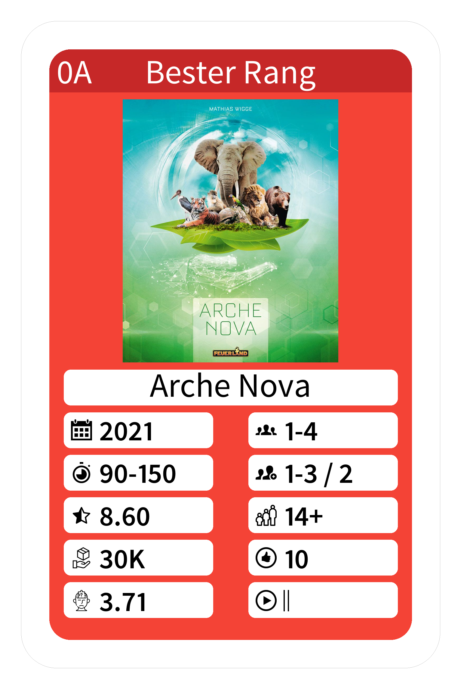

bgg-quartets
------------
A Board Game Geek powered Quartets generator, collect your collection



Setup, create venv, install requirements 

    python -m venv venv
    source venv/Scripts/activate
    pip install -r requirements.txt

Once configured run the scripts

    python 1_fetch.py
    python 2_select.py
    python 3_generate.py

# Configure

To configure the scripts copy the `config-sample.yaml` to `config.yaml` and adapt the values to your need.
It is required to provide a user to fetch the collection from the rest should work with the default values.
I did not want to provide any icons, so you have to download the icons and place them into the `resource` folder.

# Scripts

To generate cards there three steps required, each step is contained as a python file to execute.

## 1_fetch.py

Run this file to fetch the collection from the BGG API. 
It will create a `collection.xml` and `collection.csv` file in the configured **cache** folder.

The `collection.xml` contains all the data from the API, the `collection.csv` is a simplified version of the data 
that can be used to view the collection.

The requested game data will be cached as file to prevent multiple calls to the API.

## 2_select.py

Run this file to pick four sets of games from the collection 
and store the `selection.yaml` file in the configured **cache** folder.

The currently implemented sets are the following:

 - Top games with the highest rank
 - Top games for two players
 - Top games for many players
 - Top games that the collection player has played often

Each set has the following properties:

 - Cards in the category "Expansion for Base-game" are not considered
 - A set cannot contain cards of a previous set 
 - The default group names are "A", "B", "C", "D" and "E" for the Joker set
 - The default size of a set is 13 and can be configured
 - The project aims to generate 55 cards. 
   - Four sets of 13
   - Two Joker cards
   - One cover card. 

The Joker cards can be configured in the `config.yaml` file as **extra** 
or added manually to the output `selection.yaml`.
Feel free to add any additional selection algorythm to the `2_select.py` file.

Here is an excerpt of the generated yaml file, and it's structure:

```yaml
groups:
  A:
    category: Best rank
    color: '#F44336'
    top-color: '#c62828'
    games:
    - _id: '342942'
      age: 14+
      image: https://cf.geekdo-images.com/i-STYl4vtiyOoxehKIx_EA__original/img/uwFMsibZ0AlEzlc-J0rl7o5MU5M=/0x0/filters:format(jpeg)/pic6570411.jpg
      name: Arche Nova
      owners: 30K
      players: 1-4
      players_recommended: 1-3 / 2
      playtime: 90-150
      rating: '8.60'
      user_play_count: 2
      user_rating: '10'
      weight: '3.71'
      year: '2021'
#...
```

Before generating the cards the `selection.yaml` file can be checked and edited to add or remove games from the sets.

## 3_generate.py

Run this file to generate the cards images from the selected games contained in the `selection.yaml` file.

The following steps are executed:

 - Create the configured **output** folder if it does not exist
 - Download or load the image for each game and store it in the **cache** folder
 - Generate the cards for each game in the selection
 - Generate the back of the cards

Game images can be edited in the cache folder, the script will use the cached version if it exists.
The cards are generated as png files in the configured **output** folder. 
Existing files will be overwritten.

**Note**: as the cover card does not fit into any pattern this has to be generated manually.

# Things to improve

- [ ] Add more selection algorithms
- [ ] Generate cards as vector based PDF (Less dpi issues)
- [ ] Add generation option for cover card
 
# Icons

Icons can be found on http://iconmonstr.com and www.flaticon.com/,
the Icons are not included as per licence agreement.

Icons used:

 - <a href="https://www.flaticon.com/free-icons/age-group" title="age group icons">Age group icons created by Freepik - Flaticon</a>
 - <a href="https://www.flaticon.com/free-icons/weight" title="weight icons">Weight icons created by Freepik - Flaticon</a>
 - <a href="https://www.flaticon.com/free-icons/complex" title="complex icons">Complex icons created by Freepik - Flaticon</a>
 - https://iconmonstr.com/calendar-4-png
 - https://iconmonstr.com/product-14-png
 - https://iconmonstr.com/star-half-lined-png
 - https://iconmonstr.com/thumb-14-png
 - https://iconmonstr.com/time-13-png
 - https://iconmonstr.com/user-23-png
 - https://iconmonstr.com/user-29-png
 - https://iconmonstr.com/video-15-png
